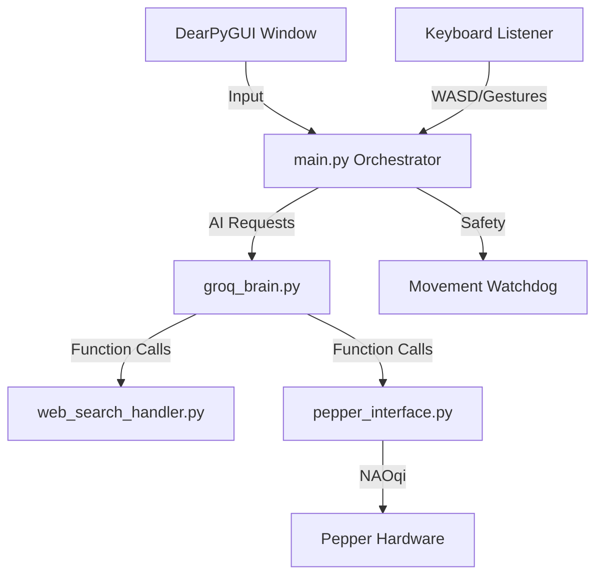

# 🤖 PEPPER AI ROBOT - PROJECT BLUEPRINT

## 📋 PROJECT OVERVIEW
**Project Name:** Pepper AI Control System
**Purpose:** Transform Pepper into an intelligent conversational assistant using modern AI (Groq, Whisper, 3-tier TTS).
**Tech Stack:** Python 3.11, Groq API (LLM + Whisper), DearPyGUI, DuckDuckGo Search, Pepper NAOqi SDK.
**Target Environment:** Educational demonstrations, visitor showcases, and classroom interaction.

---

## 🎯 STRATEGIC GOALS

### Primary Objectives:
1. **Natural Conversation** - Fluid, context-aware conversations using Groq LLMs.
2. **Current Knowledge** - Up-to-date information via web search integration.
3. **Physical Expression** - Robot gestures and movements for engaging interactions.
4. **Real-time Control** - Responsive keyboard controls for movement and demos.
5. **Professional Interface** - Modern GUI for chat and future vision streaming.

### Success Criteria:
- ✅ Sub-2 second response times for text.
- ✅ Accurate current information (2026 context).
- ✅ Natural gesture integration (non-mechanical feel).
- ✅ Stable operation for 30+ minute continuous demos.
- ✅ Easy operation by non-technical staff.

---

## 📊 PROJECT PHASES & STATUS

### ✅ PHASE 1: CORE COGNITION (COMPLETE)
*Goal: Build the foundational AI control system with text interaction.*
- **AI Brain**: Groq API integration (llama-3.3-70b-versatile) with function calling.
- **Web Search**: DuckDuckGo integration providing real-world search capability.
- **Gestures**: 12+ physical functions (wave, nod, thinking, excited, etc.).
- **GUI**: GPU-accelerated DearPyGUI interface (60 FPS).
- **History**: Conversation memory management (10-turn rolling window).

### ✅ PHASE 2: VOICE & AUDIO SYNC (COMPLETE)
*Goal: Add voice conversation and high-quality physical audio.*
- **Voice Input**: Push-to-Talk (Hold R) with Groq Whisper (`whisper-large-v3-turbo`).
- **HQ Audio Sync**: Premium voices played via Pepper's head speakers.
- **Hybrid TTS**: 3-tier fallback (Groq → ElevenLabs → Edge TTS).
- **Stability Architecture**: Movement Watchdog and Speech Concurrency Locks.

#### Technical Challenges Overcome:
- **Echo Cancellation**: Managing Pepper's built-in mics to avoid hearing her own speakers.
- **Background Noise**: Latency-optimized filtering for classroom environments.
- **Speech Collisions**: Implementing thread-safe locks to prevent overlapping audio.

### 🚧 PHASE 3: VISION & PERCEPTION (PLANNED)
*Goal: Add visual perception and live camera streaming.*
- **Camera Streaming**: Front camera (640x480 @ 30fps) to DearPyGUI texture.
- **Detection**: YOLOv8/v11 for real-time object/human detection.
- **Tracking**: Face detection (MediaPipe) and "Look-at-target" behavior.
- **Detections display**: Real-time bounding boxes and labels in the GUI.

#### Technical Approach:
- **OpenCV** for stream ingestion and frame manipulation.
- **MediaPipe** for lightweight face/pose tracking on limited hardware.
- **GPU Acceleration**: Leveraging laptop GPU for YOLO inference to maintain 30+ FPS.

### 🚧 PHASE 4: ADVANCED POLISH (FUTURE)
- **Wake Word**: "Hey Pepper" activation replacing PTT.
- **Long-term Memory**: User personalization and persistence.
- **Emotional Intelligence**: Analyzing sentiment to adjust gesture intensity.
- **Performance**: Model quantization for faster edge inference.
- **Enterprise Dashboard**: Remote web-based battery/status monitoring.

---

## 🛡️ SAFETY & ROBUSTNESS

### 1. Movement Watchdog
Prevents "runaway robot" if a network lag or SSH drop misses a key-release event. If no key activity is seen for **1.0 second**, the robot is forced to stop.

### 2. Speech Concurrency Lock
A `threading.Lock` prevents internal TTS calls from overlapping. If a second message arrives while Pepper is speaking, it is queued instead of causing audio artifacts.

### 3. Dependency Validation
Runtime checks for `PortAudio` (sounddevice) and microphone access. Provides human-friendly fix instructions instead of crashing.

---

## 🏗️ SYSTEM ARCHITECTURE

### Thread Management
- **Main Thread**: DearPyGUI rendering engine and UI callback loop.
- **Keyboard Thread**: Non-blocking `pynput` listener for real-time controls.
- **Safety Loop**: 10Hz watchdog checking movement state vs. timers.
- **Worker Threads**: Async handling for API calls, transcription, and TTS file generation.

### Data Flow (Voice Path)
`Hold R` → `sounddevice recording` → `Whisper STT` → `Groq LLM` → `HQ Audio Generation` → `ALAudioPlayer` → `Pepper Speakers`.

### Architecture Diagram

---

## 📦 TECHNICAL SPECS

### Component Map
- `main.py`: Central orchestrator and thread management.
- `pepper_interface.py`: Robot control wrapper (gestures, movement, LEDs).
- `groq_brain.py`: AI/LLM integration and prompt engineering.
- `voice_handler.py`: Cross-platform audio capture and transcription.
- `pepper_gui.py`: GPU-accelerated interface.

### Dependency List
| Category | Library | Purpose |
|----------|---------|---------|
| Robot | `qi` | Softbank Hardware SDK |
| AI Core | `groq` | LLM + Whisper STT |
| GUI | `dearpygui` | 60 FPS Interface |
| Audio | `sounddevice` | Microphone capture |
| Input | `pynput` | Keyboard monitoring |
| Search | `duckduckgo-search` | Web exploration |

---

## 📊 PERFORMANCE & ROADMAP

### Performance Metrics
| Metric | Target | Actual |
|--------|--------|--------|
| **Text Response** | <2.0s | ~1.5s |
| **Voice E2E** | <4.0s | ~3.2s |
| **GUI Latency** | <16ms | ~2ms |
| **Watchdog Halt** | 1.0s | 1.0s |
| **Search Time** | <3.0s | ~2.1s |

### Roadmap Q2-Q4 2026
1. **Q2**: Vision core (OpenCV streaming) and YOLO integration.
2. **Q3**: Wake word detection ("Hey Pepper") and conversational turn-taking.
3. **Q4**: Production polish and classroom deployment tests (STEM demo modes).

---

## 🔒 SECURITY & PRIVACY
- ✅ `.env` file management for all API keys.
- ✅ Local-only processing for physical safety routines.
- ✅ No data retention on voice clips after transcription.
- ✅ Encrypted storage (planned for Phase 4 user data).

---

## 📝 NOTES & OBSERVATIONS

### What's Working Well:
- **DearPyGUI**: Proved far superior to standard toolkits for rendering 60FPS chat.
- **Groq Llama-3**: Sub-second latency makes the robot feel "alive" and responsive.
- **Modular Design**: Separating the robot interface from the AI brain allows for testing without the robot.

### Areas for Improvement:
- **Logging**: Need more granular error tracking for remote debugging.
- **Retry Logic**: Current pipeline can fail if a single API packet is dropped.
- **Config Validation**: Moving more hardcoded strings to `.env` or `config.py`.

### 🎓 Learning Outcomes:
- **Robotics Control**: Deep understanding of the NAOqi ecosystem and proxy calls.
- **Async Systems**: Architecting multi-threaded Python to handle IO-bound API calls without freezing the UI.
- **LLM Prompt Engineering**: Tuning system messages to balance robot personality with functional accuracy.

---

## 🤝 TEAM & RESOURCES
- **Lead Developer**: Puran
- **AI Core**: Groq AI / Whisper
- **Docs**: [Groq Docs](https://console.groq.com/docs) | [Pepper SDK](http://doc.aldebaran.com/)

**Last Updated:** February 17, 2026  
🤖 **Ready for Phase 3 Vision integration!** 🚀